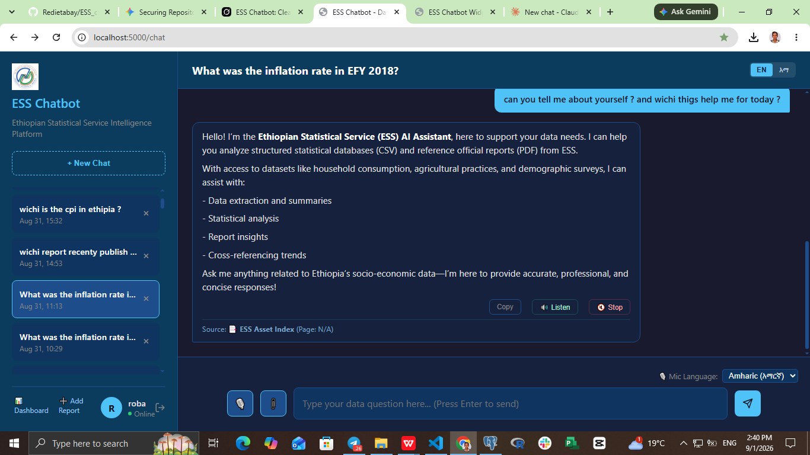
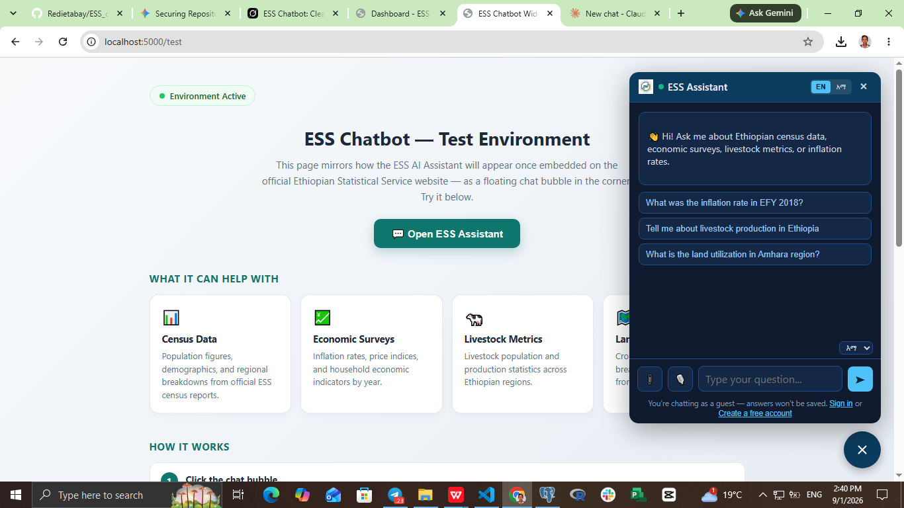
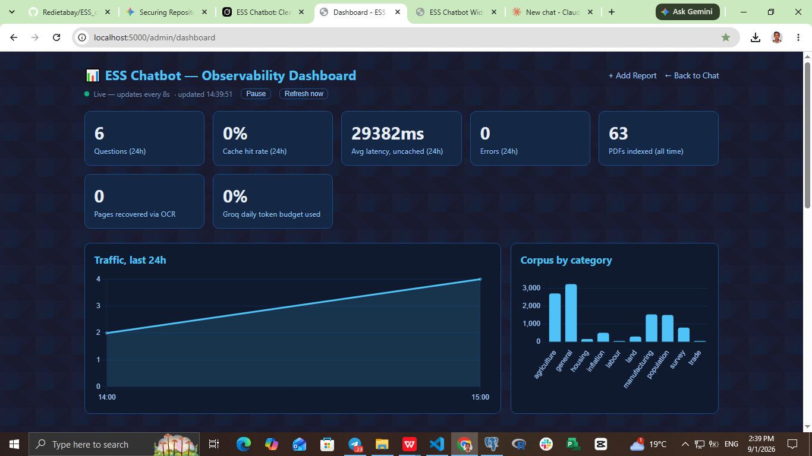

# ESS AI Assistant

**Ethiopian Statistical Service — Bilingual RAG Chatbot**

A production RAG chatbot that turns ESS's census, economic-survey, livestock,
inflation, and land-use PDF reports into instant, cited answers — in English
or Amharic, on the full dashboard or as a floating widget on the public ESS
website.


---

## Screenshots

**Chat dashboard** — sidebar history, bilingual toggle, mic input, sourced answers


**Embeddable widget** — same AI core, drops into any page as a floating bubble


**Admin observability dashboard** — live traffic, latency, OCR, and corpus stats


---

## What it does

ESS publishes dozens of statistical reports a year — often bilingual, often
scanned. Finding one number (*"what was food inflation in EFY 2018?"*)
normally means opening PDFs by hand. This assistant answers directly, with a
citation to the source document and page.

| Feature | Description |
|---|---|
| Bilingual UI + answers | English and Amharic, both interface and AI responses |
| Voice input / output | Mic input in either language; Amharic answers read aloud via server-side TTS |
| Upload & ask | Attach a PDF in chat and ask questions about that document only |
| Accounts + guest mode | Sign in to save chat history, or use as a guest |
| Embeddable widget | One `<script>` tag adds a floating assistant bubble to any page |
| Admin: one-click report upload | Drop a PDF in the browser — category/year auto-detected, indexed in under a minute, no restart |
| Observability dashboard | Live traffic, cache hit rate, latency, OCR stats, corpus breakdown |

---

## How it works

1. **Retrieval** — ESS PDFs are OCR'd where needed (Amharic + English), split
   into chunks, and embedded into ChromaDB. Bordered tables are extracted
   separately with pdfplumber so structured data survives as real tables, not
   flattened text.
2. **Routing** — an incoming question is rewritten and routed (e.g. inflation
   questions get EFY-aware year/month filtering instead of relying on
   embedding similarity alone).
3. **Generation** — the routed query and retrieved context go to the LLM
   fallback chain below, streamed back to the user with the source and page
   cited.
4. **Translation** — non-English answers are chunked under each provider's
   character limit, translated, and checked for script/quality before being
   served.

**LLM fallback chain:** `Groq → Gemini → Mistral → OpenRouter → Ollama (local, last resort)`
— all free-tier, so the app keeps answering even when one provider is
rate-limited or down.

```
User (browser / widget)
        │
        ▼
┌─────────────────────────┐
│  Flask app (app.py)     │  Auth · sessions · streaming · rate limits
└────────────┬─────────────┘
             │
      ┌──────┴───────┐
      ▼              ▼
 PostgreSQL        rag.py  ←→  retriever.py
 (users, chat      LLM routing/          ChromaDB
  history, cache,  fallback chain        (chunks + tables)
  request log)
             │
             ▼
   index_pdfs.py / report_indexer.py
   (PDF → text/OCR/tables → chunks → embeddings)
```

---

## Tech stack

| Layer | Technology |
|---|---|
| Backend | Flask |
| Auth & sessions | Flask sessions, CSRF, role-based admin |
| Vector store | ChromaDB + `paraphrase-multilingual-MiniLM-L12-v2` |
| PDF pipeline | PyMuPDF, pdfplumber, Tesseract OCR (amh+eng) |
| LLMs | Groq, Gemini, Mistral, OpenRouter, Ollama |
| Database | PostgreSQL (users, history, cache, documents, request log) |
| TTS | gTTS (Amharic) + browser Web Speech API (English) |
| Frontend | Vanilla JS, responsive CSS |

---

## Quick start

### 1. Prerequisites

- Python 3.10+
- PostgreSQL
- Tesseract OCR with `eng` + `amh` language packs

```bash
# Ubuntu/Debian
sudo apt-get install tesseract-ocr tesseract-ocr-eng tesseract-ocr-amh libpq-dev

# Windows — install from https://github.com/UB-Mannheim/tesseract/wiki,
# add it to PATH, and place amh.traineddata in the tessdata folder.
```

### 2. Clone & install

```bash
git clone https://github.com/Redietabay/ESS_chatbot.git
cd ESS_chatbot
python -m venv venv
venv\Scripts\activate        # Windows
source venv/bin/activate     # Linux/macOS
pip install -r requirements.txt
```

### 3. Environment variables

Create a `.env` file in the project root:

```env
# ── Database & Core Settings ──
DB_HOST=localhost
DB_PORT=5432
DB_NAME=ess_chatbot_db
DB_USER=

DB_PASSWORD=
SECRET_KEY=
# ── LLM Fallback Chain: Groq -> Gemini -> Mistral -> OpenRouter -> Cerebras(off) -> Ollama(off) ──
# 1) GROQ (primary — fastest, tried first)
GROQ_API_KEY=
GROQ_MODEL=openai/gpt-oss-120b
GROQ_FAST_MODEL=openai/gpt-oss-20b
GROQ_DAILY_TOKEN_LIMIT=100000
GROQ_RATE_LIMIT_MAX_WAIT=1.0
GROQ_REQUEST_TIMEOUT=30.0

# 2) GEMINI (1st fallback — most reliable in your logs; occasional DNS/503
GEMINI_API_KEY=
GEMINI_MODEL=gemini-flash-latest
# 3) MISTRAL (2nd fallback — new tier added this session; genuinely free,
MISTRAL_API_KEY=
MISTRAL_MODEL=mistral-small-latest
# 4) OPENROUTER (3rd fallback — "openrouter/free" is OpenRouter's own
OPENROUTER_API_KEY=
OPENROUTER_MODEL=openrouter/free
# 5) CEREBRAS (last cloud fallback — DISABLED: your logs show

CEREBRAS_ENABLED=false
CEREBRAS_API_KEY=
CEREBRAS_MODEL=gpt-oss-120b

# Fallback order — matches what's actually reliable per your logs, not
# guesswork. Overrides the per-tier order above.c:\Users\toshiba\Downloads\ess_chatbot_readme 2\README.md
FALLBACK_ORDER=gemini,mistral,openrouter,cerebras

# 6) OLLAMA (final local fallback — left off, matches your existing setup)
OLLAMA_ENABLED=false 
OLLAMA_BASE_URL=http://localhost:11434
OLLAMA_MODEL=llama3.2:1b

# ── Offline HuggingFace Settings ──
HF_HUB_OFFLINE=1
TRANSFORMERS_OFFLINE=1

# ── Widget & Translation Settings ──
WIDGET_EMBED_ORIGINS=https://www.statsethiopia.gov.et
GOOGLE_TRANSLATE_MODE=free

PDF_RETRIEVAL_TOP_K=6

ADMIN_USERNAMES=roba
```

### 4. Database & index

```bash
python create_tables.py

# Place ESS PDFs in data/pdf/ (optionally with a data/pdf/metadata.csv)
python index_pdfs.py
```

### 5. Run

```bash
python app.py
```

| URL | Purpose |
|---|---|
| `http://localhost:5000/chat` | Full dashboard |
| `http://localhost:5000/widget` | Widget iframe page |
| `http://localhost:5000/test` | Local widget test page |
| `http://localhost:5000/admin/dashboard` | Observability (admin only) |
| `http://localhost:5000/admin/add_report` | Upload a new report (admin only) |

---

## Embedding the widget on another site

Add one line before `</body>` on the host page:

```html
<script src="https://YOUR-CHATBOT-DOMAIN/static/js/ess-embed-loader.js"
        data-chatbot-url="https://YOUR-CHATBOT-DOMAIN"></script>
```

That's the whole integration — a floating bubble appears, and clicking it
opens an iframe pointing at `/widget` on the chatbot's own domain (avoids
cross-origin cookie/CSRF issues). No rebuild of the host site required.

---

## Project structure

```
ESS_chatbot/
├── app.py                 # Flask routes, auth, streaming, admin
├── rag.py                 # LLM orchestration, cache, rewrite, translation
├── retriever.py           # ChromaDB search + metadata helpers
├── pdf_extract.py         # Shared text / OCR / table extraction
├── indexing_helpers.py    # Chunking, category/year guessing, metadata.csv
├── report_indexer.py      # Single-PDF indexer used by /admin/add_report
├── index_pdfs.py          # Bulk offline indexer
├── tts_route.py           # Server-side Amharic TTS
├── requirements.txt
├── data/
│   ├── pdf/                     # ESS reports + metadata.csv
│   └── amharic_glossary.json
├── static/
│   ├── css/                     # style.css, widget.css
│   ├── js/                      # chat.js, widget.js, ess-embed-loader.js
│   └── images/
└── templates/              # chat, login, register, admin_*, widget, test
```

---

## Admin roles

Set `ADMIN_USERNAMES=roba,someone` in `.env` — on startup the app promotes
those usernames to admin automatically. To promote someone later:

```sql
UPDATE users SET is_admin = TRUE WHERE username = 'someone';
```

Admins see **Dashboard** and **Add Report** links in the sidebar.

---

## Known limitations

- Amharic OCR is weaker than English (Tesseract's Amharic model is less
  mature) — preprocessing and the `amh_best` model help but don't fully close
  the gap.
- Scanned tables lose structure — pdfplumber needs a vector/ruling-line
  layer, so OCR recovers scanned tables as text, not a real grid.
- Free-tier LLM quotas can rate-limit under load; the 5-tier fallback chain
  mitigates this.

---

## License

Built for the Ethiopian Statistical Service. Internal use / project
briefing — official statistics remain the property of ESS.
